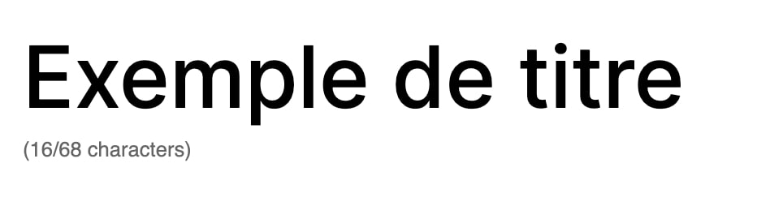

# Rich Text with Limit

This component enables to add a limit of characters on a RichText. It will display a characters counter below the text + automatically block when we've reached the limit.

```tsx
<RichTextWithLimit
	value={title}
	onChange={(title) => props.setAttributes({ title })}
	// Character Limit props
	limit={68}
	// RichText props
	allowedFormats={[]}
	tagName="h2"
/>
```

## Example


